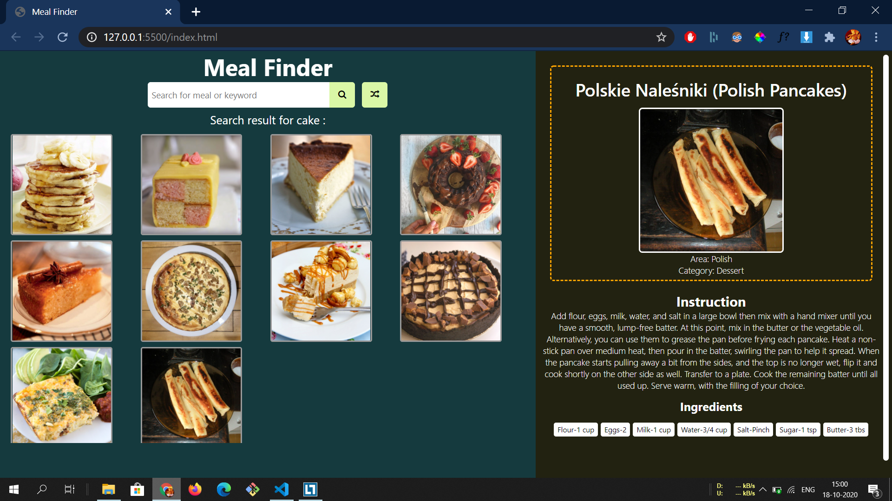

# Meal Finder
Meal finder is uses third party api called themealdb.api to fetch data.
 
 
>Description

*Search for meal and get the recipe with all ingredients*
 
 

>Visuals

 
 

>Technologies Used

1. HTML
2. CSS
3. JavaScript
 
 

>Problem Faced

TheMealDB api is confusing api which returns the data into complex json. Had to use .map method to get the data

 

> Contribution Note

Put your imagination.
